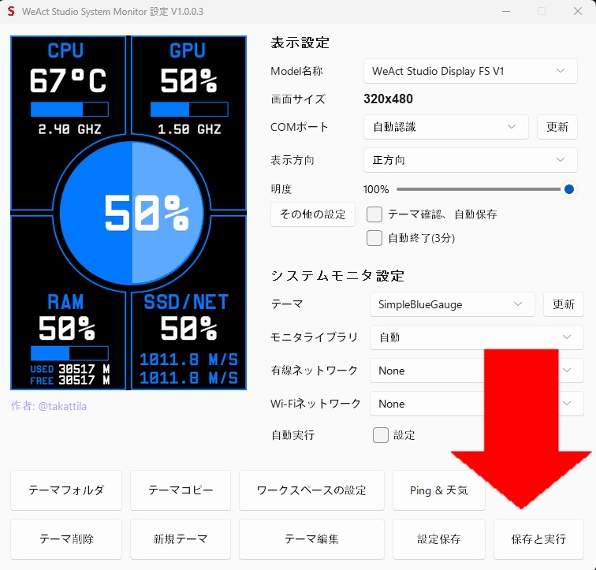

# WADFS-35 よくある質問

## Q.アプリをもう一度立ち上げたい

### A.System Monitor Configure.batを用いてアプリを立ち上げることができます。

見つからない場合は、タスクバーにある検索欄にて「System Monitor Configure.bat」を検索してください。

## Q.アプリを終了したい

### A.アプリ上にある「保存と実行」を選択することで終了できます。

