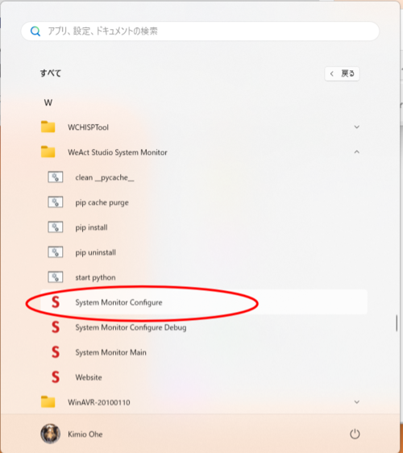

# WADFS-35 よくある質問

## Q.テーマを変更できない

### A.管理者権限でアプリを立ち上げてください。

## Q.アプリを立ち上げたい

### A.Windowsのスタートメニューより、"System Monitor Configure"を用いてアプリを立ち上げることができます。

システムモニタが起動済みの場合は、Windowsのタスクトレイの以下のアイコンを右クリックし、「設定」を選択してください。

## Q.アプリを終了したい

### A.Windowsのタスクトレイの以下のアイコンを右クリックし、「出口」を選択してください。

