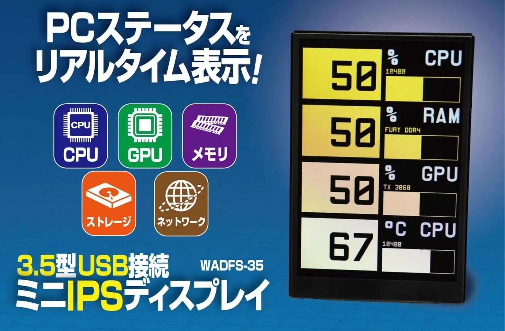

# WADFS-35-3.5inch-MINI-IPS-DISPLAY

## PCパフォーマンスを常時監視！USB接続3.5型ミニIPSディスプレイ WADFS-35

『USB接続3.5型ミニIPSディスプレイ』はWindowsのディスプレイ設定を崩さない独立型モニタです。
USBデバイスとして認識されるため、Windowsのモニタ設定を変更する必要なし。
マルチモニタ環境でもレイアウトを崩さずに情報表示を増やすことが可能です。
PCへの負荷も最低限で重たいゲームやアプリケーションを使用する際にも安心。
3.5インチの小型IPSディスプレイの省スペース設計で、デスクに馴染むコンパクトなデザインです。
付属の飾りネジやベルクロテープを利用して、モニタの横やキーボード周辺、PCケース上など柔軟な設置が可能です。

## [製品HPリンク](https://bit-trade-one.co.jp/wadfs35/) 

### [マニュアル](https://bit-trade-one.co.jp/wadfs35/manual/)

### [アプリケーションソフトウェア](https://bit-trade-one.co.jp/forUser/WADFS-35WeActStudioSystemMonitor.zip)  

### [Q&A](FAQ.md)

## 製品仕様
    【本体寸法】 約58mm×88mm×9.0mm
    【重量】 約60g【通信形式】シリアル通信
    【解像度】 320×480 RGB565
    【ディスプレイ形式】 IPS
    【ディスプレイサイズ】3.5inch
    【搭載センサ】 温度・湿度
    【電源供給】 USBより給電
    【内容物】USBケーブル(A to C)、ベルクロテープ、スタンド用飾りねじ
    【保証期間】 6か月
    【生産国】 中国

## 掲載

[「パソコンショップ アーク」様 /](https://x.com/ark_akiba/status/1918141047584244155?s=61)
[「denkijoshi」様 /] 「ミニIPSディスプレイにモンハンデータ表示させてみた」(https://note.com/denkijoshi/n/ncc04285158d1)

